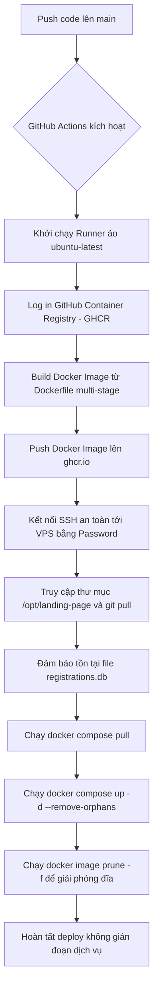

# Tài liệu triển khai hệ thống bằng Docker (CI/CD Deployment)

Tài liệu này ghi nhận kiến trúc triển khai tự động bằng **Docker & Docker Compose** cho ứng dụng `landing-page` lên máy chủ VPS Ubuntu.

---

## 1. Luồng xử lý (Workflow Pipeline)

Quy trình tự động hóa được thiết lập bằng GitHub Actions, tự động kích hoạt khi có sự kiện đẩy mã nguồn (`git push`) lên nhánh `main`.

---

## 2. Cách xử lý & Cấu hình môi trường

### Phía GitHub (GitHub Secrets & Permissions)
- **Quyền hạn của GITHUB_TOKEN**: Workflow sử dụng quyền `packages: write` để tự động đăng nhập và đẩy Docker image lên GitHub Container Registry (`ghcr.io`).
- **Secrets**:
  - `SSH_HOST`: IP của VPS.
  - `SSH_USERNAME`: Tên đăng nhập VPS (VD: `root`).
  - `SSH_PASSWORD`: Mật khẩu đăng nhập.
  - `SSH_PORT`: Cổng kết nối SSH (mặc định `22`).

### Phía VPS (Ubuntu)
- **Docker & Docker Compose**: Ứng dụng chạy độc lập trong container Docker. File `docker-compose.yml` định nghĩa service và ánh xạ cổng `20000:20000` ra ngoài.
- **Bảo toàn dữ liệu SQLite**: 
  - Cơ sở dữ liệu SQLite `registrations.db` được lưu tại `/opt/landing-page/registrations.db` trên host.
  - File này được mount vào trong container tại đường dẫn `/app/registrations.db`.
  - Tiến trình CI/CD luôn chạy `touch /opt/landing-page/registrations.db` trước khi dựng container để phòng ngừa việc Docker tự động tạo nhầm một thư mục rỗng tên là `registrations.db`.
- **Dọn dẹp tài nguyên**:
  - Lệnh `docker image prune -f` được thực thi ở cuối mỗi lần deploy để dọn dẹp các Docker image cũ (dangling images), tránh làm đầy dung lượng ổ cứng của VPS.

---

## 3. Ưu điểm & Quản lý rủi ro

- **Ưu điểm vượt trội**:
  - Không chạy build hay `npm install` trực tiếp trên VPS -> CPU/RAM VPS được giải phóng hoàn toàn, loại bỏ 100% tình trạng lag/đơ server khi CI/CD.
  - Không phụ thuộc vào PM2, NVM, Node.js cài trên VPS host.
  - Thời gian deploy thực tế trên VPS giảm xuống chỉ còn vài giây (chỉ pull layer mới và restart container).
- **Rủi ro dung lượng đĩa cứng**: 
  - Docker images cũ có thể tích tụ sau nhiều lần deploy. 
  - *Giải pháp*: Lệnh `docker image prune -f` trong workflow sẽ tự động xoá bỏ các image cũ không còn sử dụng.
