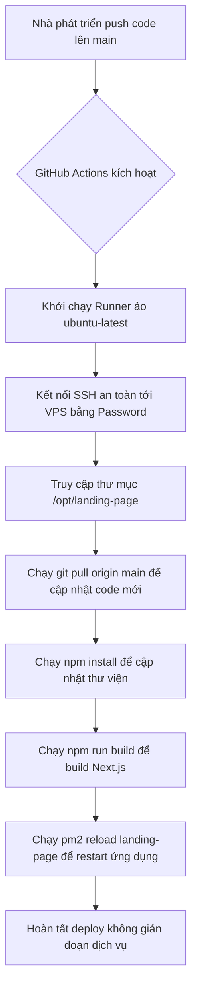

# Tài liệu triển khai hệ thống (CI/CD Deployment)

Tài liệu này ghi nhận kiến trúc triển khai tự động (CI/CD) cho ứng dụng `landing-page` lên máy chủ VPS Ubuntu.

## 1. Luồng xử lý (Workflow Pipeline)

Quy trình tự động hóa được thiết lập bằng GitHub Actions, tự động kích hoạt khi có sự kiện đẩy mã nguồn (`git push`) lên nhánh `main`.

## 2. Cách xử lý & Cấu hình môi trường

### Phía GitHub (GitHub Secrets)
Để luồng hoạt động chính xác và bảo mật, các thông tin nhạy cảm của VPS không được lưu trực tiếp trong tệp cấu hình mà được mã hóa thông qua **GitHub Repository Secrets**:
- `SSH_HOST`: IP của VPS.
- `SSH_USERNAME`: Tên đăng nhập VPS (VD: `root`).
- `SSH_PASSWORD`: Mật khẩu đăng nhập.
- `SSH_PORT`: Cổng kết nối SSH (thường là `22`).

### Phía VPS (Ubuntu)
- **Thư mục lưu trữ**: Dự án được cài đặt tại `/opt/landing-page`.
- **NodeJS & NVM**: Pipeline được thiết lập để tự động tìm và tải môi trường NVM trước khi thực hiện các lệnh build. Điều này đảm bảo tính tương thích của phiên bản Node.js được cài đặt qua NVM trên shell không tương tác.
- **PM2**: Ứng dụng chạy dưới dạng một tiến trình PM2 với tên `landing-page`. Lệnh tải lại sử dụng `pm2 reload` trước để thực hiện zero-downtime deployment, nếu thất bại (do tiến trình chưa chạy) sẽ chuyển sang lệnh dự phòng `pm2 restart`.

## 3. Độ phức tạp & Rủi ro tiềm ẩn

- **Độ phức tạp**: Thấp ($\mathcal{O}(1)$ về mặt tài nguyên mạng trên VPS khi pull delta và build).
- **Rủi ro tài nguyên (RAM VPS)**: Quá trình build Next.js (`npm run build`) có thể tiêu tốn từ 1GB đến 1.5GB RAM. Nếu VPS có cấu hình RAM thấp (ví dụ 1GB RAM) và không cấu hình bộ nhớ ảo (Swap), tiến trình build có thể bị hệ điều hành tắt đột ngột (lỗi `SIGKILL` hoặc `Out of memory`).
  - *Cách khắc phục*: Cấu hình thêm Swap space (khoảng 2GB) trên Ubuntu VPS nếu RAM vật lý dưới 2GB.
- **Quyền hạn thư mục**: Người dùng SSH kết nối cần có toàn quyền ghi vào thư mục `/opt/landing-page` và quyền thực thi PM2 global.
