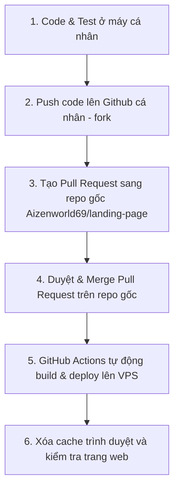

# Hướng Dẫn Quy Trình Deploy (CI/CD) Landing Page

Tài liệu này hướng dẫn chi tiết các bước để đẩy code và triển khai (deploy) ứng dụng lên máy chủ VPS thông qua hệ thống tự động hóa GitHub Actions.

---

## 1. Quy Trình Đẩy Code & Deploy Chuẩn (Git Workflow)

Để đảm bảo an toàn và tính bảo mật (không bị lộ thông tin VPS), quy trình deploy được thực hiện qua các bước sau:



### Chi tiết các bước thực hiện:

#### **Bước 1: Code và kiểm tra ở local**
*   Chạy dự án ở local bằng lệnh: `npm run dev`
*   Truy cập `http://localhost:20000` để kiểm tra các tính năng hoạt động ổn định.

#### **Bước 2: Commit và Push lên Github cá nhân (Repo Fork)**
*   Mở terminal tại thư mục dự án và chạy các lệnh:
    ```bash
    git add .
    git commit -m "feat: mô tả tính năng vừa làm"
    git push fork main
    ```

#### **Bước 3: Tạo Pull Request (PR) sang Repository gốc**
*   Truy cập vào trang so sánh và tạo PR trực tiếp bằng link sau:
    👉 **[Tạo Pull Request sang Repo gốc](https://github.com/Aizenworld69/landing-page/compare/main...hoaibao3112:landing-page:main)**
*   Nhấn nút màu xanh **`Create pull request`** để gửi yêu cầu gộp code.

#### **Bước 4: Duyệt và Merge Pull Request**
*   Sử dụng tài khoản quản trị (`Aizenworld69`) để truy cập vào Pull Request vừa tạo.
*   Nhấn nút màu xanh lá **`Merge pull request`** -> **`Confirm merge`**.
*   *Lưu ý: Ngay sau khi Merge thành công, hệ thống GitHub Actions của repo gốc sẽ tự động kích hoạt tiến trình deploy.*

---

## 2. Cách Kiểm Tra Trạng Thái Deploy

### Bước 1: Xem tiến trình chạy trên GitHub
*   Truy cập vào mục Actions của repo gốc: **[GitHub Actions](https://github.com/Aizenworld69/landing-page/actions)**
*   Theo dõi tiến trình chạy mới nhất:
    *   🟡 **Màu vàng xoay**: Đang chạy build và deploy (thường mất khoảng 1 phút).
    *   ✅ **Màu xanh lá (Success)**: Đã deploy thành công lên VPS.
    *   ❌ **Màu đỏ (Failed)**: Deploy thất bại (click vào để xem chi tiết lỗi).

### Bước 2: Kiểm tra thực tế trên trang web
*   Do trình duyệt lưu cache (bộ nhớ đệm) trang chủ Next.js rất mạnh, sau khi deploy thành công, bạn cần:
    *   Nhấn tổ hợp phím **`Ctrl + F5`** (hoặc `Ctrl + Shift + R`) để ép trình duyệt xóa cache và tải lại trang mới.
    *   Hoặc mở **Cửa sổ ẩn danh (Incognito Window)** để truy cập trang web.
*   Địa chỉ trang web chính thức: **[http://checkin.aizenworld.com](http://checkin.aizenworld.com)**
*   Địa chỉ trang quản trị Admin: **[http://checkin.aizenworld.com/admin/login](http://checkin.aizenworld.com/admin/login)**

---

## 3. Các Lỗi Thường Gặp & Cách Xử Lý

### 🔴 Lỗi 1: `Error: missing server host`
*   **Nguyên nhân**: Bạn push code trực tiếp lên repo cá nhân (fork) và kích hoạt GitHub Actions tại đây. Repo cá nhân không được cấu hình các biến bảo mật (IP VPS, mật khẩu SSH) nên hệ thống không kết nối được đến máy chủ.
*   **Cách khắc phục**: Luôn thực hiện việc deploy thông qua **Pull Request** và **Merge** vào repository gốc (`Aizenworld69/landing-page`), không chạy Actions trên repo cá nhân.

### 🔴 Lỗi 2: `Your local changes to the following files would be overwritten by merge... Aborting`
*   **Nguyên nhân**: Trên máy chủ VPS có một số file tự sinh hoặc bị chỉnh sửa thủ công trực tiếp (ví dụ: `next-env.d.ts`), làm cho lệnh `git pull` bị xung đột và tự động huỷ bỏ.
*   **Cách khắc phục**: Hiện tại hệ thống CI/CD đã được cấu hình tự động chạy lệnh `git reset --hard` và `git clean -fd` trước khi kéo code. Lệnh này sẽ tự động xóa sạch các thay đổi thừa trên VPS để việc cập nhật code luôn trơn tru. Bạn không cần làm gì thêm cho lỗi này.

### 🔴 Lỗi 3: Đã báo Deploy Success nhưng tải trang vẫn hiện giao diện cũ hoặc báo lỗi 404
*   **Nguyên nhân**: Trình duyệt hoặc hệ thống CDN đang lưu cache phiên bản cũ của trang web.
*   **Cách khắc phục**: Nhấn **`Ctrl + F5`** để xóa cache trình duyệt, hoặc test bằng chế độ ẩn danh.
